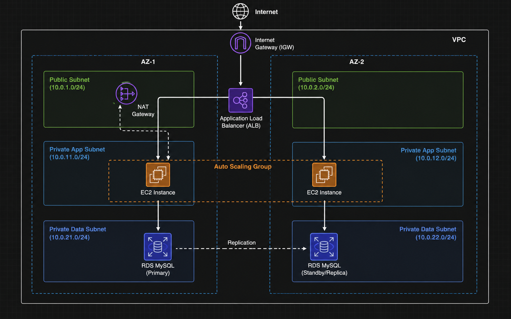
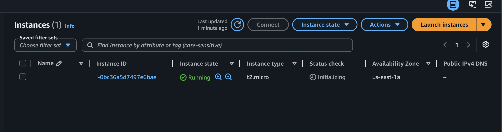
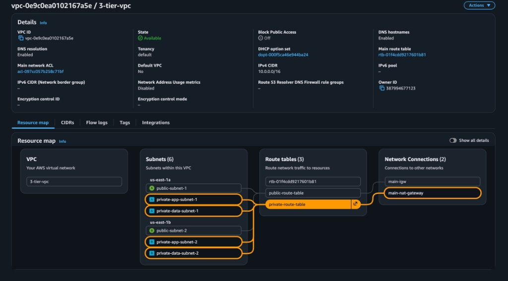
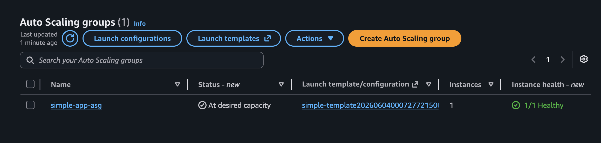
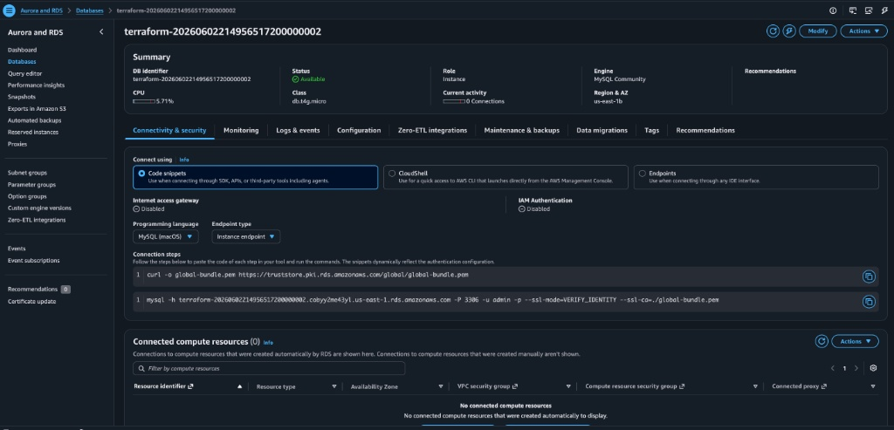

# High-Availability AWS 3-Tier Architecture via Terraform

## Project Overview
This project provisions a secure, highly available, and scalable **AWS 3-Tier Web Architecture** entirely as Infrastructure as Code (IaC) using Terraform. 

The design pattern isolates each tier into distinct subnets across multiple Availability Zones (AZs) to ensure resilience, fault tolerance, and zero single points of failure.

### Key Architecture Highlights:
* **Presentation Tier:** Public subnets hosting an internet-facing Application Load Balancer (ALB).
* **Application Tier:** Private subnets containing a dynamic EC2 Auto Scaling Group (ASG) protected from direct public access.
* **Data Tier:** Fully isolated private subnets hosting a Multi-AZ Amazon RDS MySQL cluster.

## 🏗️ Architecture Overview

This architecture separates infrastructure layers into three isolated tiers across multiple Availability Zones to ensure high availability, fault tolerance, and security.

- **Presentation Tier:** An internet-facing Application Load Balancer (ALB) distributed across Public Subnets to securely route external user traffic.
- **Application Tier:** A self-healing Auto Scaling Group (ASG) maintaining instances inside Private App Subnets, driven by an AWS Launch Template configuration blueprint.
- **Data Tier:** Isolated Private Data Subnets designed to host a secure Amazon RDS database cluster.

## 🔒 Remote State Management & Locking

To support team collaboration and prevent state corruption in CI/CD environments, this project uses a remote Terraform backend:
- **Amazon S3:** Stores the `terraform.tfstate` file centrally with encryption enabled (`encrypt = true`).
- **Amazon DynamoDB:** Handles atomic state locking to prevent concurrent deployment runs from corrupting state data.

```hcl
terraform {
  backend "s3" {
    bucket         = "your-terraform-state-bucket"
    key            = "3-tier-project/terraform.tfstate"
    region         = "us-east-1"
    dynamodb_table = "terraform-state-locks"
    encrypt        = true
  }
}


---

## Architecture Diagram


---

## AWS Services & Terraform Features Used

* **Networking:** VPC, Public/Private Subnets (2x each across 2 AZs), Internet Gateway (IGW), NAT Gateway, Route Tables.
* **Compute & Scaling:** EC2, Launch Templates, Auto Scaling Group (ASG), Application Load Balancer (ALB).
* **Database:** Amazon RDS MySQL with automated storage autoscaling.
* **Security:** Layered Security Groups forming a strict **Chain Link Security** mechanism (ALB ➔ EC2 ➔ RDS).
* **HCL Concepts:** `count` meta-arguments, dynamic data sources (`aws_availability_zones`), explicit dependencies (`depends_on`), and input variable abstraction.

---
---

## 🔍 Deployment Verification

### 1. Networking Tier (VPC Resource Map)
The AWS Console confirms the successful automatic generation of our highly available 3-tier VPC network infrastructure across isolated subnets:





### 2. Database Tier (Amazon RDS MySQL)
The relational database instance is deployed in a healthy state and bound to our private data subnet parameters:



##  How to Deploy This Infrastructure

## CI/CD Automation Pipeline

This repository utilizes an automated **GitHub Actions CI Pipeline** (`.github/workflows/terraform-ci.yml`) to enforce code quality, syntax validation, and dry-run infrastructure planning before code deployment.

### Automated Checks Performed:
1. **Source Code Checkout:** Clones the active workspace onto an isolated `ubuntu-latest` cloud runner environment.
2. **Terraform CLI Engine Initialization:** Dynamically bootstraps and configures the standard HashiCorp Terraform runtime workspace.
3. **Automated Code Formatting (`terraform fmt`):** Validates and enforces consistent programmatic layout constraints across configuration code assets.
4. **Syntactical Code Validation (`terraform validate`):** Validates declaration integrity, parameters, and variable references before remote API execution.
5. **AWS Workspace Handshake (`terraform init`):** Securely logs into AWS utilizing repository-level encrypted secret tokens to fetch platform provider plugin components.
6. **Infrastructure Predictive Planning (`terraform plan`):** Generates structural layout plans mapping upcoming cloud lifecycle changes live to the GitHub interface logs.

## 🛠️ Local Development Quickstart

### Prerequisites
- Terraform CLI (v1.5.0+) Installed locally
- AWS CLI configured with active IAM programmatic credentials

### Execution Cycle
```bash
# Initialize working directory and pull plugins
terraform init

# Validate configuration syntax integrity
terraform validate

# Review structural deployment blueprints
terraform plan

# Deploy infrastructure assets live to AWS
terraform apply --auto-approve
